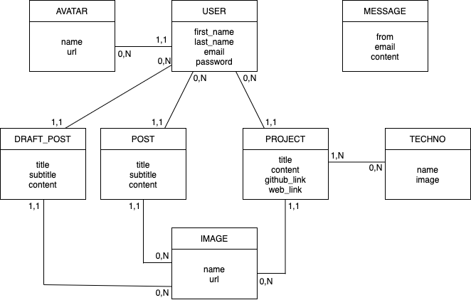

# API

## MCD

## Router

### USER

| Rôle | Méthode | URL |
| ---- | ------- | --- |
| Créer ou modifier un utilisateur | POST | /users/save |
| Récupérer tous les utilisateurs | GET | /users |
| Récupérer un utilisateur | GET | /users/:id |
| Supprimer un utilisateur | DELETE | /users/delete/:id |

### MESSAGE

| Rôle | Méthode | URL |
| ---- | ------- | --- |
| Créer un message | POST | /messages/save |
| Récupérer tous les messages | GET | /messages |
| Récupérer un message | GET | /messages/:id |
| Supprimer un message | DELETE | /messages/delete/:id |

### POST

| Rôle | Méthode | URL |
| ---- | ------- | --- |
| Créer ou modifier un article | POST | /posts/save |
| Récupérer tous les articles | GET | /posts |
| Récupérer un article | GET | /posts/:id |
| Supprimer un article | DELETE | /posts/delete/:id |

### PROJECT

| Rôle | Méthode | URL |
| ---- | ------- | --- |
| Créer ou modifier un projet | POST | /projects/save |
| Récupérer tous les projets | GET | /projects |
| Récupérer un projet | GET | /projects/:id |
| Récupérer un projet en utilisant son titre | GET | /projects/bytitle/:title |
| Supprimer un projet | DELETE | /projects/delete/:id |

### AVATAR

| Rôle | Méthode | URL |
| ---- | ------- | --- |
| Créer un avatar | POST | /avatars/save |
| Récupérer tous les avatars | GET | /avatars |
| Récupérer un avatar | GET | /avatars/:id |
| Supprimer un avatar | DELETE | /avatars/delete/:id |

### IMAGE

| Rôle | Méthode | URL |
| ---- | ------- | --- |
| Créer une image | POST | /images/save |
| Récupérer toutes les images | GET | /images |
| Récupérer une image | GET | /images/:id |
| Supprimer une image | DELETE | /images/delete/:id |

### TECHNO

| Rôle | Méthode | URL |
| ---- | ------- | --- |
| Créer une techno | POST | /technos/save |
| Récupérer toutes les technos | GET | /technos |
| Récupérer une techno | GET | /technos/:id |
| Supprimer une techno | DELETE | /technos/delete/:id |

### Association PROJET / TECHNO

| Rôle | Méthode | URL |
| ---- | ------- | --- |
| Créer une association | POST | /projects/technos/save |
| Récupérer les associations par projet | GET | /projects/:id/technos |
| Récupérer les associations par techno | GET | /technos/:id/projects |
| Supprimer une association | DELETE | /projects/:project_id/technos/:techno_id/delete |
